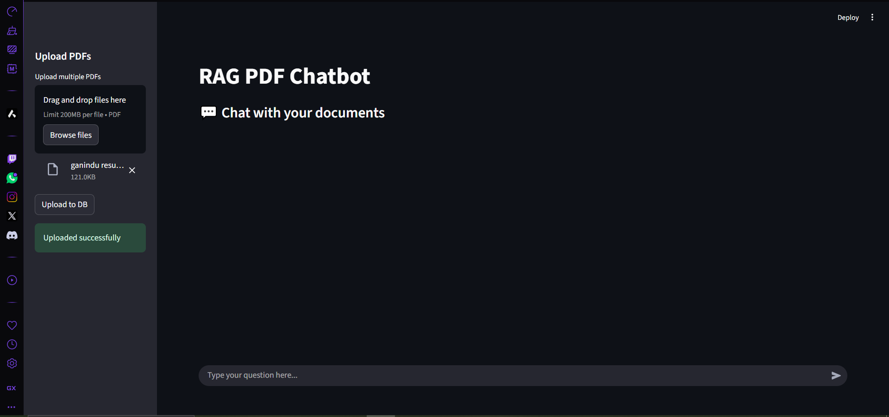

# MediBot -Modular RAG PDF Chatbot with FastAPI, Pinecone & Streamlit




This project is a modular **Retrieval-Augmented Generation (RAG)** application that allows users to upload PDF documents and chat with an AI assistant that answers queries based on the document content. It features a microservice architecture with a decoupled **FastAPI backend** and **Streamlit frontend**, using **ChromaDB** as the vector store and **Groq's LLaMA3 model** as the LLM.

---

## 📂 Project Structure

```
MediBot/
├── client/         # Streamlit Frontend
│   |──components/
|   |  |──chatUI.py
|   |  |──history_download.py
|   |  |──upload.py
|   |──utils/
|   |  |──api.py
|   |──app.py
|   |──config.py
├── server/         # FastAPI Backend
│   ├── chroma_store/ ....after run
|   |──modules/
│      ├── load_vectorestore.py
│      ├── llm.py
│      ├── pdf_handler.py
│      ├── query_handlers.py
|   |──uploaded_pdfs/ ....after run
│   ├── logger.py
│   └── main.py
└── README.md
```

---

## ✨ Features

- 📄 Upload and parse PDFs
- 🧠 Embed document chunks with HuggingFace embeddings
- 💂️ Store embeddings in ChromaDB
- 💬 Query documents using LLaMA3 via Groq
- 🌍 Microservice architecture (Streamlit client + FastAPI server)

---

## 🎓 How RAG Works

Retrieval-Augmented Generation (RAG) enhances LLMs by injecting external knowledge. Instead of relying solely on pre-trained data, the model retrieves relevant information from a vector database (like Pinecone vectorstore) and uses it to generate accurate, context-aware responses.

---


## 🚀 Getting Started Locally

### 1. Clone the Repository

```bash
git clone https://github.com/Anurada23/MediBot--RAG-PDF-llama-Chatbot-with-FastAPI-ChromaDB-Streamlit-Pinecone-Groq.git
```

### 2. Setup the Backend (FastAPI)

```bash
cd server
python -m venv venv
source venv/bin/activate  # Windows: venv\Scripts\activate
pip install -r requirements.txt

# Set your Groq API Key (.env)
GROQ_API_KEY="your_key_here"

# Run the FastAPI server
uvicorn main:app --reload
```

### 3. Setup the Frontend (Streamlit)

```bash
cd ../client
pip install -r requirements.txt  # if you use a separate venv for client
streamlit run app.py
```

---

## 🌐 API Endpoints (FastAPI)

- `POST /upload_pdfs/` — Upload PDFs and build vectorstore
- `POST /ask/` — Send a query and receive answers

Testable via Postman or directly from the Streamlit frontend.

---

## 🌐 Snowflake Setup

-- Step 1: Create Warehouse
CREATE WAREHOUSE MEDI_ANALYTICS_WH 
    WAREHOUSE_SIZE = 'XSMALL' 
    AUTO_SUSPEND = 300 
    AUTO_RESUME = TRUE;

-- Step 2: Create Database and Schema
CREATE DATABASE MEDI_ANALYTICS;
USE DATABASE MEDI_ANALYTICS;
CREATE SCHEMA PUBLIC;
USE SCHEMA PUBLIC;

-- Step 3: Create Tables with all columns
CREATE TABLE chat_logs (
    user_id STRING,
    model_used STRING,
    tokens_used NUMBER,
    latency_ms NUMBER,
    timestamp TIMESTAMP,
    question STRING
);

CREATE TABLE doc_stats (
    doc_id STRING,
    queries_count NUMBER,
    avg_response_time NUMBER
);

-- Optional: Create indexes for better query performance
CREATE INDEX idx_chat_logs_timestamp ON chat_logs(timestamp);
CREATE INDEX idx_chat_logs_user_id ON chat_logs(user_id);
CREATE INDEX idx_doc_stats_doc_id ON doc_stats(doc_id);


## ✉️ Contact

For questions or suggestions, open an issue or contact at [anuradasenaratne23@gmail.com]

---

